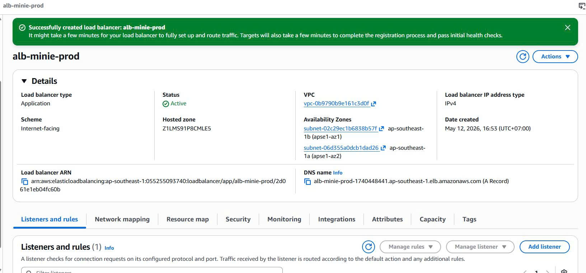
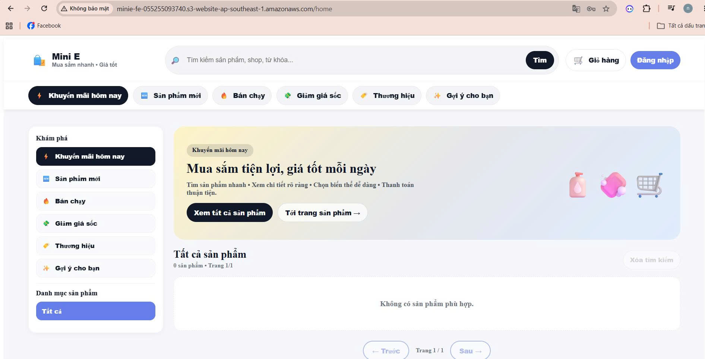
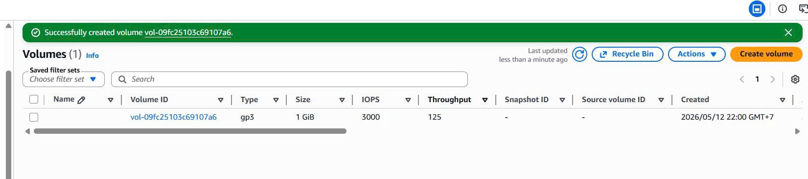
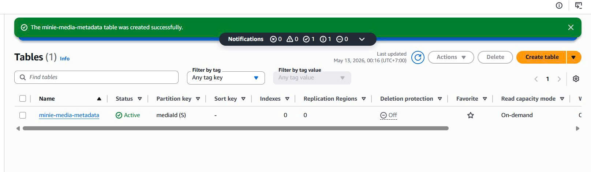
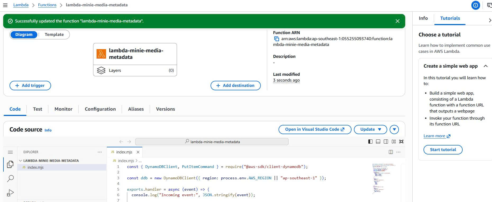
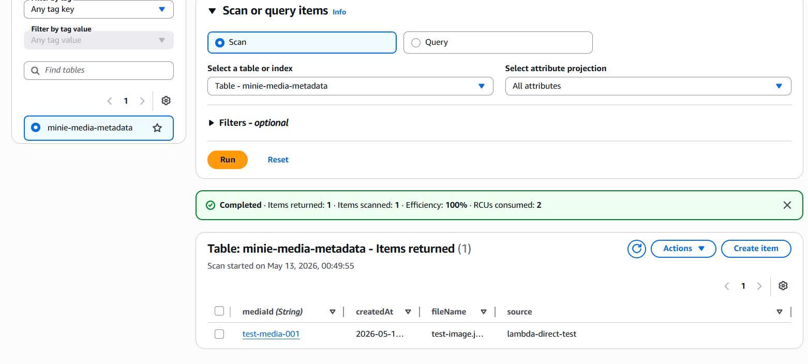
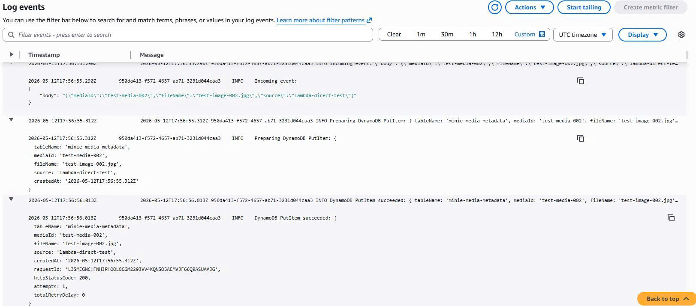

## Bước 1 : Tạo IAM Group User , Users, Roles
* Phải tạo IAM Group User , Users, Roles để tránh hacker lấy được credentials thì sẽ bị xóa hết resources và mỗi người dùng chỉ nên có 1 số quyền nhất định 
## 1.1 Tạo User Group (Gộp các User vào 1 khung để đều có các quyền hạn nhất định)
- Ở trong trang chính của AWS, tìm kiếm đến IAM -> click vào User groups ở phần Access Management -> click Create group
- Chọn tên của nhóm: DevOps-Team, kéo xuống ở phần Attach permissions policies - Optional ( ở đây e sẽ gán các quyền mà các user trong nhóm này sẽ cùng có)
- Các tìm kiếm và chọn các quyền:
   - [ ] `AmazonECS_FullAccess`
   - [ ] `AmazonRDSFullAccess`
   - [ ] `ElastiCacheFullAccess`
   - [ ] `AmazonVPCFullAccess`
   - [ ] `CloudFrontFullAccess`
   - [ ] `AmazonS3FullAccess`
   - [ ] `AmazonEC2FullAccess`
   - [ ] `CloudWatchLogsFullAccess`
   - [ ] `AWSNetworkFirewallFullAccess` 
   - [ ] `AmazonElasticFileSystemFullAccess` 
   - [ ] `AWSBackupFullAccess` 
   - [ ] `AmazonAPIGatewayAdministrator` 
   - [ ] `AWSLambda_FullAccess` 
   - [ ] `AmazonDynamoDBFullAccess`
   - [ ] `AmazonEC2ContainerRegistryFullAccess`
- Vì mỗi Group chỉ giới hạn 10 policy nên hãy tạo 2 Group vào tag 1 user vào 2 group đó
 

 

## 1.2 Tạo IAM User
1. Vào IAM -> Users -> Create user
2. User name: `devops-admin`
3. Provide user access to the AWS Management Console: Check
4. Users must create a new password at next sign-in: Uncheck (để không phải đổi password lần đầu)
6. Click Next
7. Add user to group: chọn `DevOps-Team-Policy-1` và `DevOps-Team-Policy-2`
8. Click Next -> Create user

## 1.3 Tạo IAM Role cho ECS Task Execution
1. Vào **IAM** → **Roles** → **Create role**
2. **Trusted entity type:** AWS service
3. **Use case:** chọn **Elastic Container Service** → chọn **Elastic Container Service Task**
4. Click **Next**
5. **Add permissions** — tìm và chọn:
   - [ ] `AmazonECSTaskExecutionRolePolicy`
   - [ ] `CloudWatchLogsFullAccess`
   - [ ] `AmazonEC2ContainerRegistryReadOnly`
6. Click **Next**
7. **Role name:** `ecsTaskExecutionRole-minie-W5`
8. **Description:** `ECS task execution role for pulling images and writing logs`
9. Click **Create role** 
## 1.4 Tạo IAM Role cho ECS Task Role
> Role này cho phép application code trong container truy cập S3 bucket `media-s3-minie` và ghi logs.
1. Vào **IAM** → **Roles** → **Create role**
2. **Trusted entity type:** AWS service
3. **Use case:** chọn **Elastic Container Service** → chọn **Elastic Container Service Task**
4. Click **Next**
5. **Add permissions** — chọn:
   - [ ] `CloudWatchLogsFullAccess`
6. Click **Next**
7. **Role name:** `ecsTaskRole-minie-W5`
8. **Description:** `ECS task role for application to access S3 media bucket`
9. Click **Create role**
10. Click vào role `ecsTaskRole-minie-W5` vừa tạo
11. Vào tab **Permissions** → click **Add permissions** → **Create inline policy**
12. Chọn tab **JSON** → paste nội dung sau:
```json
{
  "Version": "2012-10-17",
  "Statement": [
    {
      "Effect": "Allow",
      "Action": [
        "s3:GetObject",
        "s3:PutObject",
        "s3:DeleteObject"
      ],
      "Resource": "arn:aws:s3:::media-s3-minie/*"
    },
    {
      "Effect": "Allow",
      "Action": "s3:ListBucket",
      "Resource": "arn:aws:s3:::media-s3-minie"
    }
  ]
}
```
13. Click **Next**
14. **Policy name:** `minie-s3-media-access`
15. Click **Create policy**

## 1.5 Tạo Lambda Execution Role
> Role này cho phép Lambda functions ghi logs, đọc S3, và ghi DynamoDB.
1. Vào **IAM** → **Roles** → **Create role**
2. **Trusted entity type:** AWS service
3. **Use case:** chọn **Lambda**
4. Click **Next**
5. **Add permissions** — chọn:
   - [ ] `AWSLambdaBasicExecutionRole` (cho CloudWatch Logs)
6. Click **Next**
7. **Role name:** `lambdaRole-minie-W5`
8. **Description:** `Lambda execution role for S3 read and DynamoDB write`
9. Click **Create role**
10. Click vào role `lambdaRole-minie` vừa tạo
11. Vào tab **Permissions** → click **Add permissions** → **Create inline policy**
12. Chọn tab **JSON** → paste nội dung sau:
```json
{
  "Version": "2012-10-17",
  "Statement": [
    {
      "Effect": "Allow",
      "Action": ["s3:GetObject"],
      "Resource": "arn:aws:s3:::media-s3-minie/*"
    },
    {
      "Effect": "Allow",
      "Action": ["dynamodb:PutItem", "dynamodb:GetItem"],
      "Resource": "arn:aws:dynamodb:ap-southeast-1:*:table/minie-media-metadata"
    }
  ]
}
```
13. Click **Next**
14. **Policy name:** `minie-lambda-s3-dynamo`
15. Click **Create policy**

## 2 Build Frontend và Build & Push Backend Docker Image
## 2.1 Build Frontend
1. Mở terminal, cd vào folder frontend: cd mini-e_web/mini-e_fe_web
2. Cài dependencies: npm install
3. Chạy build command: npm run build

## 2.1 Build & Push Backend Docker Image
- Tạo Access Key mới trong AWS Console: 
+ IAM → Users → devops-admin → Security credentials → Access keys → Create access key
+ Chọn Command Line Interface (CLI)
+ Lưu Access key về máy
- Configure lại AWS CLI: mở terminal chạy lệnh "aws configure" và nhập Access Key ID và Secret Access Key vừa mới được nhận
- Sử dụng lệnh "aws ecr get-login-password --region ap-southeast-1" để lấy password/token tạm thời từ AWS ECR để Docker có thể đăng nhập vào Elastic Container Registry
- Chạy lệnh "aws ecr get-login-password --region ap-southeast-1 | docker login --username AWS --password-stdin 055255093740.dkr.ecr.ap-southeast-1.amazonaws.com" để đăng nhập vào docker
- Build Docker image bằng lệnh "docker build -t minie-backend:latest ."
- Tag image sang ECR URI bằng lệnh: "docker tag minie-backend:latest 055255093740.dkr.ecr.ap-southeast-1.amazonaws.com/minie-backend:latest"
- Tạo repository ECR bằng lệnh: aws ecr create-repository --repository-name minie-backend --region ap-southeast-1
- Push image lên ECR bằng lệnh: docker push 055255093740.dkr.ecr.ap-southeast-1.amazonaws.com/minie-backend:latest

## 3 Tạo 2 VPC
## 3.1 Tạo VPC App
- VPC → Your VPCs → Create VPC
- Chọn: 
+ Resources to create: VPC and more
+ Name tag auto-generation: minie-app
+ IPv4 CIDR block: 10.0.0.0/16
+ IPv6 CIDR block: No IPv6 CIDR block
+ Number of AZs: 2
+ Number of public subnets: 2
+ Number of private subnets: 2
+ NAT gateways: 1 per AZ
+ VPC endpoints: S3 Gateway
+ DNS options:
  * Enable DNS hostnames
  * Enable DNS resolution

## 3.2 Tạo VPC Database
- Tương tự tạo VPC Database với Options sau:
+ Name tag auto-generation: minie-db
+ IPv4 CIDR block: 10.1.0.0/16
+ Number of AZs: 2
+ Number of public subnets: 0
+ Number of private subnets: 2
+ NAT gateways: None
+ VPC endpoints: None
DNS options:
  * Enable DNS hostnames
  * Enable DNS resolution

## 3.3 Tạo VPC Peering Connection
- VPC → Peering connections → Create peering connection
- Chọn: 
Name: peering-app-to-db
VPC ID requester: chọn minie-app / vpc-app / 10.0.0.0/16
Account: My account
Region: This region ap-southeast-1
VPC ID accepter: chọn minie-db / vpc-db / 10.1.0.0/16
-> Click Create peering connection
- Sau đó accept: Actions → Accept request → Accept request

## 3.4 Cập nhật Route Tables 2 chiều
- Vào VPC → Route tables
**Chiều 1: VPC App → VPC Database:**
- Tìm route table đang associate với app-vpc-app-a và app-vpc-app-b

- Với mỗi route table của app private subnet, thêm route:
+ Destination: 10.1.0.0/16
+ Target: Peering Connection -> pcx-071abb39c28d5aeb3 (id của Peering Connection vừa tạo)

**Chiều 2: VPC Database → VPC App:**
- Tìm route table đang associate với db-vpc-db-a và db-vpc-db-b

- Với mỗi route table của app private subnet, thêm route:
+ Destination: 10.0.0.0/16
+ Target: Peering Connection -> pcx-071abb39c28d5aeb3 (id của Peering Connection vừa tạo)

## 4 Tạo Security Groups
## 4.1 Tạo Security Groups trong VPC App
 **Tạo SG cho ALB:**
- EC2 → Security Groups → Create security group
- Chọn như sau: 
+ Security group name: alb-minie
+ Description: Allow HTTP/HTTPS from Internet
+ VPC: minie-app / vpc-app
+ Inbound rules như sau: 

+ Outbound: All traffic → 0.0.0.0/0
 **SG cho ECS Backend:**
- Chọn như sau: 
+ Security group name: ecs-minie
+ Description: Allow backend traffic from ALB
+ VPC: minie-app / vpc-app
+ Inbound và Outbound rules như sau: 

 **Tạo SG cho EFS**
- Chọn như sau: 
+ Security group name: efs-minie
+ Description: Allow NFS from ECS
+ VPC: minie-app / vpc-app
+ Inbound và Outbound rules như sau: 

## 4.2 Tạo Security Groups trong VPC DB
 **Tạo SG cho RDS MySQL**
- Chọn như sau: 
+ Security group name: rds-minie
+ Description: Allow MySQL from App VPC via Peering
+ VPC: minie-db / vpc-db
+ Inbound và Outbound rules như sau: 

 **Tạo SG cho Redis / Valkey**
- Chọn như sau: 
+ Security group name: redis-minie
+ Description: Allow Redis from App VPC via Peering
+ VPC: minie-db / vpc-db
+ Inbound và Outbound rules như sau: 


## 5 Tạo RDS MySQL trong VPC Database
## 5.1 Tạo DB Subnet Group
- Vào RDS → Subnet groups → Create DB subnet group
- Điền:
+ Name: db-subnet-group-minie
+ Description: DB subnet group for Mini E RDS in database VPC
+ VPC: minie-db / vpc-db
- Phần Availability Zones chọn:
+ ap-southeast-1a
+ ap-southeast-1b
- Phần Subnets chọn 2 subnet database:
+ db-vpc-db-a
+ db-vpc-db-b
-> Create
## 5.2 Tạo RDS MySQL
- Vào RDS → Databases → Create database
- Chọn:
+ Choose a database creation method: Standard create
+ Engine type: MySQL
+ Engine version: MySQL 8.0.x
+ Templates: Sanbox (đang chạy ở acc free tier qua acc Work Shop thì đổi lại Dev)
- Settings:
+ DB instance identifier: minie-mysql-prod
+ Master username: admin
+ Credentials management: Self managed
+ Master password: dùng password bạn đã chuẩn bị
+ DB instance class: db.t3.micro
+ Storage type: gp3
- Connectivity:
+ Compute resource: Don’t connect to an EC2 compute resource
+ Virtual private cloud: minie-db / vpc-db
+ DB subnet group: db-subnet-group-minie
+ Public access: No
+ VPC security group: Choose existing
+ Existing VPC security groups: sg-rds-minie
+ Availability Zone: No preference
+ Database port: 3306
- Additional configuration:
+ Initial database name: miniedb
+ Backup retention period: 7 days


## 6 Tạo ElastiCache Redis / Valkey
## 6.1 Tạo Cache Subnet Group
- Vào ElastiCache → Subnet groups → Create subnet group
- Điền: 
+_ Name: redis-subnet-group-minie
+ Description: Redis subnet group for Mini E in database VPC
+ VPC: minie-db / vpc-db
- Chọn subnets:
+ db-vpc-db-a
+ db-vpc-db-b
-> Create
## 6.2 Tạo Redis / Valkey Cluster
- ElastiCache → Valkey caches → Create
- Name: redis-minie-prod
- Deployment option: Node-based cluster
- Creation method: Easy create
- Configuration: Demo
- Subnet groups -> Choose existing subnet group -> Chọn subnet group đã tạo
-> Create

## 7 Tạo S3 Buckets
## 7.1 Tạo S3 Frontend Bucket
- S3 → Buckets → Create bucket
- Điền Bucket name: minie-fe-055255093740
- Tạo xong Upload các file trong dist của folder FE từ máy

## 7.2 Tạo S3 Media Bucket
- Tượng tự:
+ Bucket name: media-s3-minie
+ ACLs disabled
+ Block all public access: ON
+ Default encryption: SSE-S3
- Tạo 2 folder: products và avatars
## 8 Tạo Application Load Balancer và Target Group
## 8.1 Target Group cho BE
- EC2 → Target Groups → Create target group
- Chọn:
+ Target type: IP addresses
- Cấu hình:
+ Target group name: tg-minie-backend
+ Protocol: HTTP
+ Port: 3000
+ VPC: minie-app / VPC App
+ Protocol version: HTTP1
- Health check:
+ Health check protocol: HTTP
+ Health check path: /api
- Advanced health check settings để như sau:
+ Healthy threshold: 2
+ Unhealthy threshold: 2
+ Timeout: 5 seconds
+ Interval: 30 seconds
+ Success codes: 200
- Sau đó Next → Create target group

## 8.2 Application Load Balancer
- EC2 → Load Balancers → Create Load Balancer
- Chọn: Application Load Balancer → Create
- Cấu hình:
+ Load balancer name: alb-minie-prod
- Network mapping: VPC: minie-app / VPC App
- Mappings:
+ ap-southeast-1a → app-vpc-public-a
+ ap-southeast-1b → app-vpc-public-b
- Security group: sg-alb-minie
- Listener:
+ Protocol: HTTP
+ Port: 80
+ Default action: Forward to tg-minie-backend
- Sau đó bấm: Create load balancer

## 9 Tạo ECS Cluster và Task Definition
## 9.1 Tạo ECS Cluster
- ECS → Clusters → Create cluster
- Điền: Cluster name: cluster-minie-prod
- Infrastructure: AWS Fargate
- Bấm Create
## 9.2 Tạo ECS Task Definition

- Vào ECS → Task definitions → Create new task definition
- Chọn cấu hình:
  + Task definition family: minie-backend-task
  + Launch type: AWS Fargate
  + Operating system/Architecture: Linux/X86_64
  + CPU: 1 vCPU
  + Memory: 2 GB

- Task roles:
  + Task role: ecsTaskRole-minie-W5
  + Task execution role: ecsTaskExecutionRole-minie-W5

> Task execution role dùng để ECS pull image từ ECR và ghi log lên CloudWatch.  
> Task role dùng để application trong container truy cập S3 media bucket.

- Container definition:
  + Container name: minie-backend
  + Image URI: 055255093740.dkr.ecr.ap-southeast-1.amazonaws.com/minie-backend:latest
  + Container port: 3000
  + Protocol: TCP
  + App protocol: HTTP

- Environment variables:
...

- Logging:
  + Log driver: awslogs
  + Log group: /ecs/minie-backend-task
  + Region: ap-southeast-1
  + Stream prefix: ecs

- Sau đó bấm Create task definition.


---

## 10 Tạo ECS Service

- ECS → Clusters → cluster-minie-prod → Services → Create
- Chọn:
  + Compute options: Launch type
  + Launch type: FARGATE
  + Platform version: LATEST

- Deployment configuration:
  + Application type: Service
  + Task definition family: minie-backend-task
  + Revision: Latest
  + Service name: svc-minie-backend
  + Service type: Replica
  + Desired tasks: 2

- Networking:
  + VPC: minie-app / vpc-0b9790b9e161c3d0f
  + Subnets:
    * app-vpc-app-a
    * app-vpc-app-b
  + Security group: sg-ecs-minie
  + Public IP: Disabled

> ECS backend được đặt trong private subnets của VPC App.  


- Load balancing:
  + Load balancer type: Application Load Balancer
  + Load balancer: alb-minie-prod
  + Listener: HTTP:80
  + Target group: tg-minie-backend
  + Container: minie-backend:3000
  + Health check grace period: 60 seconds

- Sau đó bấm Create service.

---

## 10.1 Verify ECS Service

Sau khi tạo ECS Service, kiểm tra:

- ECS → cluster-minie-prod → Services → svc-minie-backend → Tasks
- Kết quả mong muốn:
  + Tasks chuyển sang RUNNING
  + Desired tasks = 2
  + Running tasks = 2


Tiếp theo kiểm tra Target Group:

- EC2 → Target Groups → tg-minie-backend → Targets
- Kết quả mong muốn:
  + Targets được ECS tự động register
  + Status = healthy


---

## 10.2 Test API qua ALB

Chạy lệnh kiểm tra health check API:

```powershell
curl http://alb-minie-prod-1740448441.ap-southeast-1.elb.amazonaws.com/api
```


## 11 Cập nhật Frontend và Deploy lên S3 Static Website
- File .env.production của frontend được cấu hình:
VITE_API_BASE_URL=http://alb-minie-prod-1740448441.ap-southeast-1.elb.amazonaws.com/api
- Build lại frontend:
+ cd mini-e_web/mini-e_fe_web
+ npm run build
- Upload lại toàn bộ nội dung bên trong thư mục dist/ lên bucket FE
- Deploy thành công: 

## MH1 — Multi-VPC Connectivity
## 1.Tạo Flow Logs
- Flow Logs cho VPC App:
+ VPC → Your VPCs → minie-app
+ Flow logs → Create flow log
+ Cấu hình:
+ Name: flowlog-vpc-app
+ Filter: All
+ Maximum aggregation interval: 1 minute
+ Destination: Send to CloudWatch Logs
+ Log group: /vpc/minie-app-flowlogs


- Flow Logs cho VPC Database:
+ VPC → Your VPCs → minie-db
+ Flow logs → Create flow log
+ Cấu hình:
+ Name: flowlog-vpc-db
+ Filter: All
+ Maximum aggregation interval: 1 minute
+ Destination: Send to CloudWatch Logs
+ Log group: /vpc/minie-db-flowlogs


## Evidence Flow Logs: App VPC → Database VPC
- Dùng CloudWatch Logs Insights trên log group: /vpc/minie-app-flowlogs
- Query: 
fields @timestamp, @message
| filter @message like /10\.1\./
| filter @message like /3306/
| filter @message like /ACCEPT/
| sort @timestamp desc
| limit 50

*Ý nghĩa:*
- 10.0.143.228: ECS/App trong VPC App
- 10.1.137.132: RDS MySQL trong VPC Database
- 3306: MySQL port
- ACCEPT OK: Traffic được route và security group cho phép
 ## Evidence Flow Logs: Database VPC nhận traffic từ App VPC
 - Dùng CloudWatch Logs Insights trên log group: /vpc/minie-db-flowlogs
 - Query:
fields @timestamp, @message
| filter @message like /10\.0\./
| filter @message like /3306/
| filter @message like /ACCEPT/
| sort @timestamp desc
| limit 50

-Kết quả ghi nhận traffic:
+ 10.0.143.228 → 10.1.137.132  36380 → 3306  ACCEPT OK
+ 10.1.137.132 → 10.0.143.228  3306 → 36380  ACCEPT OK
- Ý nghĩa:
+ Dòng thứ nhất là request từ App VPC sang RDS MySQL trong Database VPC.
+ Dòng thứ hai là response từ RDS MySQL quay lại ECS backend trong App VPC.
+ Cả hai dòng đều có ACCEPT OK, chứng minh route table và security group cho phép traffic 2 chiều.

## Evidence ALB → ECS trong VPC App


## MH2 — Network Firewall
## 1 Tạo Firewall Subnets trong VPC App
- VPC → Subnets → Create subnet
- Chọn: VPC ID: minie-app 
- Tạo 2 subnet:
+ Subnet 1:
* Subnet name: firewall-subnet-a
* Availability Zone: ap-southeast-1a
* IPv4 CIDR block: 10.0.32.0/20
+ Subnet 2:
* Subnet name: firewall-subnet-b
* Availability Zone: ap-southeast-1b
* IPv4 CIDR block: 10.0.48.0/20

## 2 Tạo Network Firewall Rule Group
- Vào VPC → Network Firewall → Network Firewall rule groups → Create rule group


## MH3-A — Tạo EFS File System
- EFS → File systems → Create file system
- Chọn: Name: efs-minie-shared
- Cấu hình:
+ File system type: Regional
+ Performance mode: General Purpose
+ Throughput mode: Bursting
+ Lifecycle management: Optional / default
+ Encryption: Enable encryption
- Network access:
+ VPC: minie-app
+ Mount targets:
- ap-southeast-1a → app-vpc-app-a
- ap-southeast-1b → app-vpc-app-b
+ Security group: sg-efs-minie

## MH3-B — Tạo Access Point cho ECS
- Vào EFS vừa tạo: EFS → efs-minie-shared → Access points → Create access point
- Điền:
+ Name: ap-minie-shared
+ Root directory path: /minie-shared
- POSIX user:
+ User ID: 1000
+ Group ID: 1000
- Root directory creation permissions:
+ Owner user ID: 1000
+ Owner group ID: 1000
+ Permissions: 755

## MH3-C — Gắn EFS vào ECS Task Definition
- Vào: ECS → Task definitions → minie-backend-task → Create new revision
- Tìm phần Volumes, thêm volume:
Volume name: minie-shared-efs
Volume type: EFS
File system ID: efs-minie-shared / fs-xxxxxxxx
Transit encryption: Enabled
Authorization config:
Access point ID: fsap-xxxxxxxx
IAM: Enabled
Root directory: /
- Sau đó vào container minie-backend, phần Mount points:
+ Source volume: minie-shared-efs
+ Container path: /mnt/minie-shared
+ Read only: false


## MH3-D — Bật ECS Exec để kiểm tra EFS trong container
- Vì ECS Fargate không SSH trực tiếp vào máy được, em sử dụng ECS Exec để vào container backend.
- Vào ECS → Clusters → cluster-minie-prod → Services → svc-minie-backend → Update
- Ở phần Troubleshooting configuration, bật:
  + Turn on ECS Exec
- Chọn:
  + Force new deployment
- Click Update service.
Sau khi task mới RUNNING, kiểm tra ECS Exec bằng AWS CLI:
```powershell
aws ecs list-tasks `
  --cluster cluster-minie-prod `
  --service-name svc-minie-backend `
  --region ap-southeast-1
```
- Sau đó kiểm tra task có bật ExecuteCommandAgent hay chưa:
aws ecs describe-tasks `
  --cluster cluster-minie-prod `
  --tasks <TASK_ARN> `
  --region ap-southeast-1 `
  --query "tasks[0].{lastStatus:lastStatus,enableExecuteCommand:enableExecuteCommand,managedAgents:containers[0].managedAgents}"

- Nếu máy local chưa có Session Manager Plugin thì cài bằng winget:
```powershell
winget search "Session Manager Plugin"
winget install Amazon.SessionManagerPlugin
```
## MH3-E — Test ghi và đọc file trên EFS gốc
- Sau khi ECS Exec đã hoạt động, vào container backend bằng lệnh: 
```powershell
aws ecs execute-command `
  --cluster cluster-minie-prod `
  --task <TASK_ARN> `
  --container minie-backend `
  --interactive `
  --command "/bin/sh" `
  --region ap-southeast-1
```
- Trong container, kiểm tra mount path EFS:
ls -la /mnt
ls -la /mnt/minie-shared
- Tạo file test trên EFS:
echo "Mini E shared file test - W5 MH3" > /mnt/minie-shared/mh3-test.txt
cat /mnt/minie-shared/mh3-test.txt
- Kết quả: 

**Điều này chứng minh ECS backend trong private subnet đã mount thành công EFS shared file system và có thể ghi/đọc dữ liệu dùng chung.**

## MH3-F — Tạo Backup Vault
- Vào AWS Backup → Backup vaults → Create backup vault
Cấu hình:
+ Backup vault name: minie-w5-backup-vault
+ Encryption key: Default AWS Backup vault key
- Click Create backup vault.

## MH3-G — Tạo EBS Volume test cho Backup Plan
- Theo yêu cầu MH3, backup plan phải bao trùm ít nhất 3 loại resource có state:
+ File system: EFS
+ Database: RDS
+ Block storage: EBS
- Vì stack hiện tại không có EC2/EBS volume dùng trực tiếp cho application, em tạo một EBS volume nhỏ để đưa vào backup plan evidence.
- Vào EC2 → Elastic Block Store → Volumes → Create volume
- Cấu hình:
+ Volume type: gp3
+ Size: 1 GiB
+ Availability Zone: ap-southeast-1a
+ Name tag: ebs-minie-w5-backup-test
- Click Create volume.

## MH3-H — Tạo Backup Plan
- Vào AWS Backup → Backup plans → Create backup plan
- Chọn:
+ Build a new plan
- Cấu hình: Backup plan name: minie-w5-backup-plan
- Backup rule:
+ Backup rule name: daily-7days-retention
+ Backup vault: minie-w5-backup-vault
+ Backup frequency: Daily
+ Backup window: Default
+ Retention period: 7 days
- Click Create plan.

## MH3-I — Assign Resources vào Backup Plan
- Trong backup plan minie-w5-backup-plan, chọn Assign resources.
- Cấu hình:
+ Resource assignment name: minie-w5-stateful-resources
+ IAM role: AWSBackupDefaultServiceRole
+ Resource selection: Include specific resource types
## MH3-J — Tạo On-demand Backup
- Để không phải chờ lịch daily backup, em tạo on-demand backup thủ công cho các resource quan trọng.
## On-demand backup cho EFS
- AWS Backup → Protected resources → Create on-demand backup
- Chọn:
+ Resource type: EFS
+ File system: efs-minie-shared / fs-0b302015efed783b6
+ Backup vault: minie-w5-backup-vault
+ IAM role: AWSBackupDefaultServiceRole
- Click Create on-demand backup.
## On-demand backup cho RDS
- AWS Backup → Protected resources → Create on-demand backup
- Chọn:
+ Resource type: RDS
+ Database: minie-mysql-prod
+ Backup vault: minie-w5-backup-vault
+ IAM role: AWSBackupDefaultServiceRole
+ Chờ Backup job Completed.
## On-demand backup cho EBS
- AWS Backup → Protected resources → Create on-demand backup
- Chọn:
+ Resource type: EBS
+ Volume: ebs-minie-w5-backup-test
+ Backup vault: minie-w5-backup-vault
+ IAM role: AWSBackupDefaultServiceRole
- Chờ Backup job Completed.


## MH3-K — Restore Test EFS từ Recovery Point
- Đề yêu cầu backup plan phải được test restore thật, nên em thực hiện restore EFS từ recovery point.
- Vào AWS Backup → Backup vaults → minie-w5-backup-vault
- Mở tab Recovery points
- Chọn recovery point của EFS efs-minie-shared
- Chọn Actions → Restore
- Cấu hình restore:
+ Restore type: Full restore
+ Restore location: Restore to a new file system
+ File system type: Regional
+ Performance: General purpose
+ Encryption: Enabled
+ Restore role: Default role
+ Copy tags: ON
- Sau đó click Restore backup.

## MH3-L — Kiểm tra Restored EFS
- Sau khi restore completed, vào EFS → File systems.
- Restored EFS:
- Name: efs-minie-shared-restore-test-v2
- File system ID: fs-05c4192a1325c6c77
- VPC: minie-app / vpc-0b9790b9e161c3d0f
- Kiểm tra Network access:
+ Mount targets:
- ap-southeast-1a → app-vpc-app-a
- ap-southeast-1b → app-vpc-app-b
+ Security group: efs-minie / sg-0bc81e32536786a7a

## MH3-M — Tạo Access Point cho Restored EFS
- Để mount restored EFS vào ECS, tạo access point mới.
- Vào restored EFS efs-minie-shared-restore-test-v2
- Access points → Create access point
- Cấu hình:
+ Name: ap-minie-restore-root
+ Root directory path: /
+ POSIX user: 1000 : 1000
+ State: Available

## MH3-N — Mount Restored EFS vào ECS Task Definition
- Tạo revision mới của minie-backend-task.
- Ở phần Volumes, thêm volume restore:
+ Volume name: minie-restore-efs
+ Volume type: EFS
+ File system ID: fs-05c4192a1325c6c77
+ Access point ID: fsap-0b63ee4918f0743d8
+ Root directory: /
+ Transit encryption: Enabled

- Ở container minie-backend, thêm mount point:
+ Source volume: minie-restore-efs
+ Container path: /mnt/minie-restore
+ Read only: No
- Ngoài ra container vẫn giữ EFS gốc:
+ Source volume: minie-shared-efs
+ Container path: /mnt/minie-shared
+ Read only: No

- Sau đó update ECS Service:
+ ECS → cluster-minie-prod → svc-minie-backend → Update
+ Task definition revision: latest
+ Turn on ECS Exec: checked
+ Force new deployment: checked
- Chờ task mới RUNNING.
## MH3-O — Restore Test: Đọc lại file từ Restored EFS
- Sau khi task mới RUNNING, dùng ECS Exec vào container:
aws ecs execute-command `
  --cluster cluster-minie-prod `
  --task <TASK_ARN> `
  --container minie-backend `
  --interactive `
  --command "/bin/sh" `
  --region ap-southeast-1

- Trong container, kiểm tra restored EFS:
ls -la /mnt/minie-restore
find /mnt/minie-restore -type f

**Kết Quả**:


## MH4-A — Tạo DynamoDB table
- Vào DynamoDB → Tables → Create table
- Điền:
+ Table name: minie-media-metadata
+ Partition key: mediaId
+ Type: String
+ Table settings: Default settings
- Bấm Create table.

## MH4-B — Tạo Lambda function
- Vào Lambda → Functions → Create function
- Chọn:
+ Author from scratch
+ Function name: lambda-minie-media-metadata
+ Runtime: Node.js 20.x hoặc Node.js 22.x
+ Architecture: x86_64
+ Execution role: Use an existing role
+ Existing role: lambdaRole-minie-W5
- Bấm Create function
- Sau đó vào tab Code: 

import { DynamoDBClient, PutItemCommand } from "@aws-sdk/client-dynamodb";

const TABLE_NAME = process.env.TABLE_NAME || "minie-media-metadata";

const ddb = new DynamoDBClient({
  region: process.env.AWS_REGION || "ap-southeast-1",
});

export const handler = async (event) => {
  console.log("Incoming event:", JSON.stringify(event));

  try {
    const body = event.body ? JSON.parse(event.body) : {};

    const mediaId = body.mediaId || `media-${Date.now()}`;
    const fileName = body.fileName || "unknown-file";
    const source = body.source || "api-gateway";
    const createdAt = new Date().toISOString();

    const item = {
      mediaId: { S: mediaId },
      fileName: { S: fileName },
      source: { S: source },
      createdAt: { S: createdAt },
    };

    console.log("Preparing DynamoDB PutItem:", {
      tableName: TABLE_NAME,
      mediaId,
      fileName,
      source,
      createdAt,
    });

    const putResult = await ddb.send(
      new PutItemCommand({
        TableName: TABLE_NAME,
        Item: item,
      })
    );

    console.log("DynamoDB PutItem succeeded:", {
      tableName: TABLE_NAME,
      mediaId,
      fileName,
      source,
      createdAt,
      requestId: putResult.$metadata?.requestId,
      httpStatusCode: putResult.$metadata?.httpStatusCode,
      attempts: putResult.$metadata?.attempts,
      totalRetryDelay: putResult.$metadata?.totalRetryDelay,
    });

    return {
      statusCode: 200,
      headers: {
        "Content-Type": "application/json",
      },
      body: JSON.stringify({
        success: true,
        message: "Media metadata saved to DynamoDB",
        data: {
          mediaId,
          fileName,
          source,
          createdAt,
          tableName: TABLE_NAME,
          dynamoDbStatusCode: putResult.$metadata?.httpStatusCode,
          dynamoDbRequestId: putResult.$metadata?.requestId,
        },
      }),
    };
  } catch (error) {
    console.error("Lambda error:", {
      name: error.name,
      message: error.message,
      stack: error.stack,
    });

    return {
      statusCode: 500,
      headers: {
        "Content-Type": "application/json",
      },
      body: JSON.stringify({
        success: false,
        message: error.message,
      }),
    };
  }
};

- Vào Configuration → Environment variables, thêm: TABLE_NAME=minie-media-metadata
- Bấm Deploy

- Test event
Dùng test event này: {
  "body": "{\"mediaId\":\"test-media-001\",\"fileName\":\"test-image.jpg\",\"source\":\"lambda-direct-test\"}"
}

- Sau đó vào DynamoDB table minie-media-metadata kiểm tra item test-media-001

- Log khi test với: {
  "body": "{\"mediaId\":\"test-media-002\",\"fileName\":\"test-image-002.jpg\",\"source\":\"lambda-direct-test\"}"
}

## MH4-D — Tạo REST API Gateway
- Vào API Gateway → APIs → Create API
- Chọn:
+ REST API
+ Build
- Điền:
+ API name: api-minie-media
+ Endpoint type: Regional
- Bấm Create API.
## MH4-E — Tạo Resource và Method
Trong API api-minie-media:
- Resources → Create resource
- Tạo resource: Resource path: /media
- Chọn /media, tạo resource tiếp: Resource path: /metadata
- Chọn resource /media/metadata, bấm:
+ Create method
+ Chọn:
* Method type: POST
* Integration type: Lambda function
* Lambda proxy integration: ON
* Lambda function: lambda-minie-media-metadata

## MH4-F — Bật API Key Required cho method
- Chọn method: POST /media/metadata → Method request
- Tìm: API Key Required
- Chỉnh thành: true
- Save lại.
- Sau đó Deploy API:
+ Stage: New stage
+ Stage name: prod

## MH4-G — Tạo API Key
- Vào bên trái API Gateway: API Keys → Create API key
- Điền:
+ Name: api-key-minie-media
+ Auto generate: chọn
- Bấm Save.
- Sau khi tạo, bấm Show để copy value API key.

## MH4-H — Tạo Usage Plan + Throttling
- Vào Usage Plans → Create usage plan
- Điền:
+ Name: usage-plan-minie-media
+ Description: Throttling plan for Mini E media metadata API
- Throttling:
+ Rate: 5 requests per second
+ Burst: 10 requests
- Quota có thể để:
+ Enable quota: optional
+ Requests: 1000 per day
- Add API stage:
+ API: api-minie-media
+ Stage: prod
- Add API key: api-key-minie-media
- Save.

## MH4-I — Test curl authenticated 200
Chạy PowerShell:
$API_URL="https://<api-id>.execute-api.ap-southeast-1.amazonaws.com/prod/media/metadata"
$API_KEY="<API_KEY_VALUE>"

curl -Method POST `
  -Uri $API_URL `
  -Headers @{ "x-api-key" = $API_KEY; "Content-Type" = "application/json" } `
  -Body '{"mediaId":"api-gw-test-001","fileName":"api-gateway-test.jpg","source":"api-gateway-authenticated"}'

**Kết Quả**:


## MH4-J — Test curl unauthenticated 403
Chạy không có API key:
curl -Method POST `
  -Uri $API_URL `
  -Headers @{ "Content-Type" = "application/json" } `
  -Body '{"mediaId":"api-gw-test-no-key","fileName":"blocked.jpg","source":"no-api-key"}'


## MH4-K — Cập nhật ứng dụng gọi API Gateway
- API Gateway endpoint được sử dụng:
https://rf2yeas777.execute-api.ap-southeast-1.amazonaws.com/prod/media/metadata
- Trong ECS Task Definition của backend, em thêm 2 biến môi trường:
API_GATEWAY_MEDIA_METADATA_URL=https://rf2yeas777.execute-api.ap-southeast-1.amazonaws.com/prod/media/metadata
API_GATEWAY_MEDIA_API_KEY=<API_KEY_VALUE>
- Trong code backend, sau khi seller tạo sản phẩm có upload ảnh, backend gọi API Gateway bằng HTTP request với header x-api-key.
- Đoạn logic được thêm vào backend:
private async sendMediaMetadataToApiGateway(payload: {
  mediaId: string;
  fileName: string;
  source: string;
  productId?: number;
  sellerId?: number;
  imageUrl?: string;
  cloudinaryPublicId?: string;
  bytes?: number;
  format?: string;
}) {
  const apiUrl = process.env.API_GATEWAY_MEDIA_METADATA_URL;
  const apiKey = process.env.API_GATEWAY_MEDIA_API_KEY;

  if (!apiUrl || !apiKey) {
    console.warn('API Gateway media metadata env is missing. Skip metadata sync.', {
      hasApiUrl: Boolean(apiUrl),
      hasApiKey: Boolean(apiKey),
      mediaId: payload.mediaId,
    });
    return null;
  }

  console.log('Calling API Gateway media metadata endpoint:', {
    apiUrl,
    mediaId: payload.mediaId,
    fileName: payload.fileName,
    source: payload.source,
    productId: payload.productId,
  });

  const response = await fetch(apiUrl, {
    method: 'POST',
    headers: {
      'Content-Type': 'application/json',
      'x-api-key': apiKey,
    },
    body: JSON.stringify(payload),
  });

  const responseText = await response.text();

  console.log('API Gateway media metadata response:', {
    mediaId: payload.mediaId,
    status: response.status,
    ok: response.ok,
    body: responseText,
  });

  if (!response.ok) {
    throw new Error(
      `API Gateway media metadata call failed. Status=${response.status}, Body=${responseText}`,
    );
  }

  return responseText ? JSON.parse(responseText) : null;
}
- Trong luồng tạo sản phẩm, sau khi product được tạo thành công, backend gọi API Gateway cho từng ảnh đã upload:
if (uploadedImagesMetadata.length > 0) {
  await Promise.allSettled(
    uploadedImagesMetadata.map((image, index) =>
      this.sendMediaMetadataToApiGateway({
        mediaId: `product-${product.id}-image-${index + 1}-${Date.now()}`,
        fileName: image.originalName,
        source: 'mini-e-backend-products-create',
        productId: product.id,
        sellerId: userId,
        imageUrl: image.cloudinaryUrl,
        cloudinaryPublicId: image.cloudinaryPublicId,
        bytes: image.bytes,
        format: image.format,
      }),
    ),
  );
}

- Sau khi chỉnh code backend, build lại Docker image và push lên ECR
- Sau đó cập nhật ECS Service
## MH4-L — Test ứng dụng gọi API Gateway khi tạo sản phẩm
- Em đăng nhập vào website bằng tài khoản seller/admin và tạo một sản phẩm mới có upload ảnh.
- Kết quả trên frontend:

## MH4-M — Evidence ECS Backend gọi API Gateway thành công
- CloudWatch → Log groups → /ecs/minie-backend-task

**Điều này chứng minh backend ECS đã gọi API Gateway endpoint thành công. API Gateway sau đó invoke Lambda và Lambda ghi metadata vào DynamoDB.**
## MH4-N — Evidence Lambda ghi DynamoDB từ request của backend
- CloudWatch → Log groups → /aws/lambda/lambda-minie-media-metadata

**Điều này chứng minh Lambda đã nhận request metadata ảnh từ API Gateway và ghi thành công vào DynamoDB.**
## MH4-O — Evidence DynamoDB có metadata từ backend
- DynamoDB → Tables → minie-media-metadata → Explore table items


## MH5 — Serverless Scaling Pattern - S3-Event-Triggered Lambda Pattern
## 1 — Sửa Lambda code để hỗ trợ cả API Gateway và S3 Event
- Vào: Lambda → Thay toàn bộ code Lambda:

## 2 — Tạo S3 trigger cho Lambda
- Vào Lambda → Functions → lambda-minie-media-metadata
- Chọn Add trigger
- Cấu hình:
+ Source: S3
+ Bucket: media-s3-minie
+ Event type: All object create events
+ Prefix: products/
+ Suffix: để trống hoặc .jpg nếu chỉ test jpg
+ Recursive invocation warning: tick xác nhận nếu AWS hỏi
- Bấm Add.

## 3 — Upload file test vào S3
- Vào: S3 → Buckets → media-s3-minie → products/
- Upload một ảnh: ALB.jpg

## 4 — Check Lambda logs
- Vào CloudWatch → Log groups → /aws/lambda/lambda-minie-media-metadata
- Mở log stream mới nhất

=> Lambda được trigger bởi S3 event
=> Event đến từ bucket media-s3-minie, file upload nằm trong products/ALB.jpg.
## 5 — Check DynamoDB item
- Vào DynamoDB → Tables → minie-media-metadata → Explore table items

=> Item từ S3 trigger đã được ghi vào table