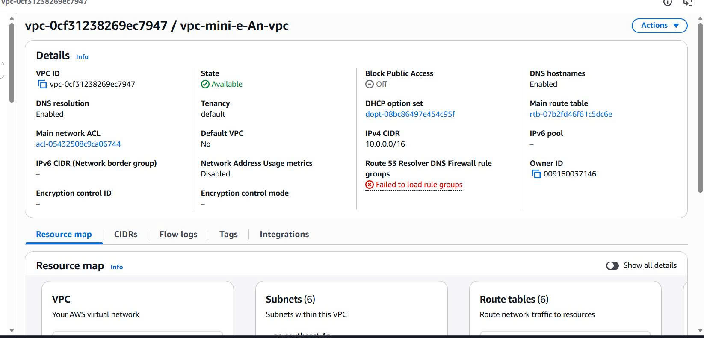
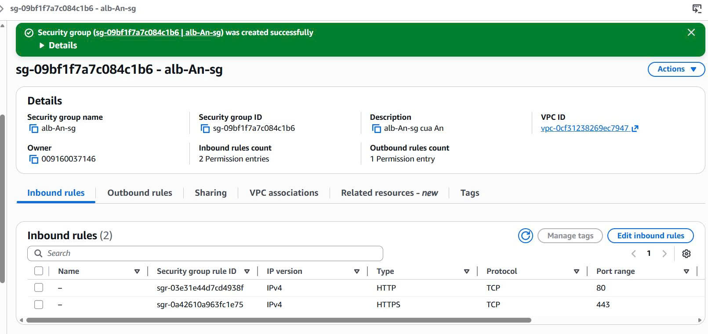
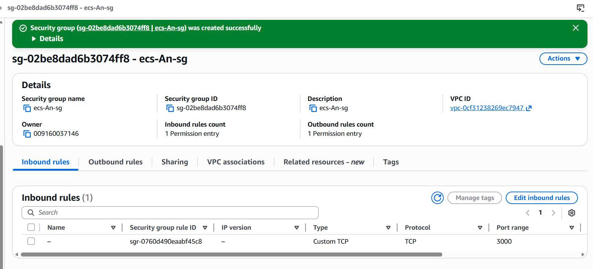
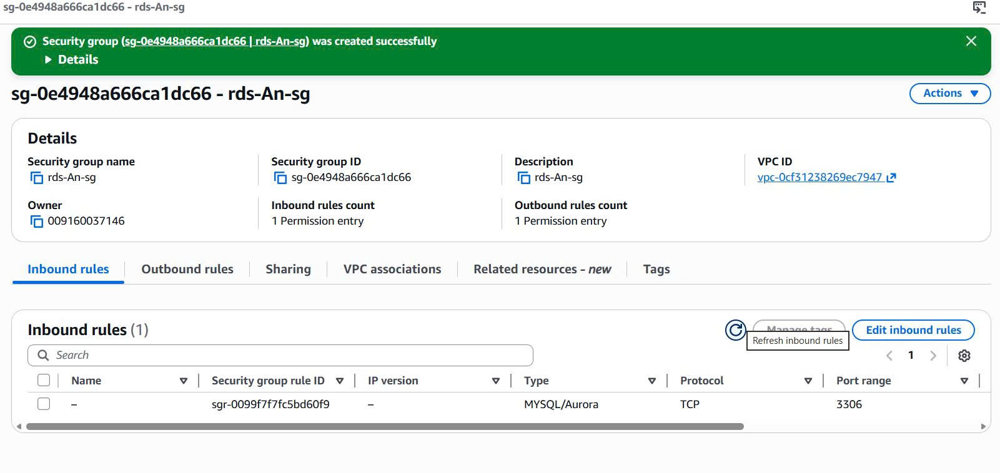
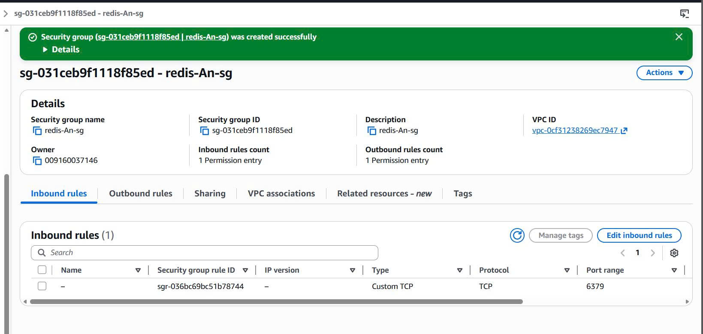
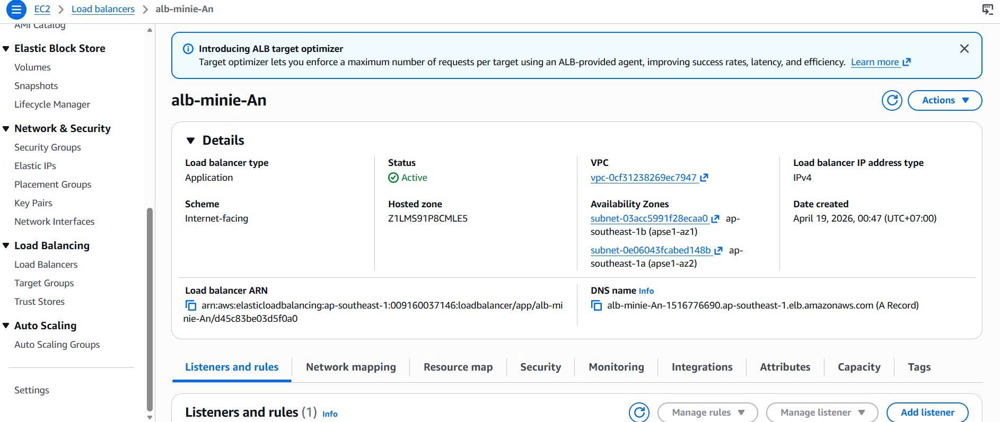
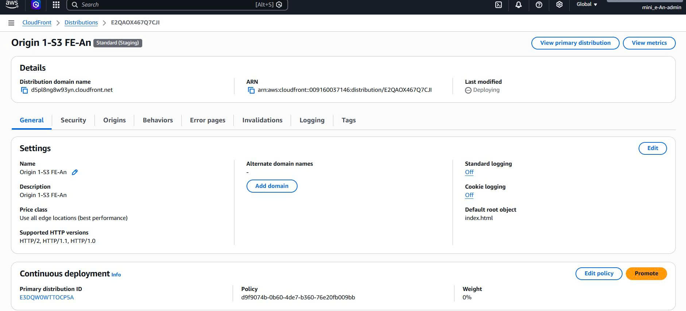
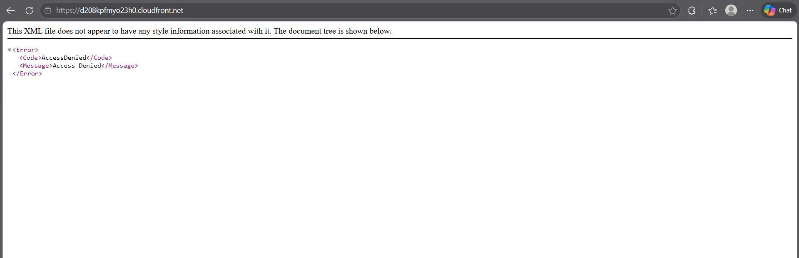

Bước 1 : Tạo IAM Group User , Users, Roles
* Phải tạo IAM Group User , Users, Roles để tránh hacker lấy được credentials thì sẽ bị xóa hết resources và mỗi người dùng chỉ nên có 1 số quyền nhất định 
1.1 Tạo User Group (Gộp các User vào 1 khung để đều có các quyền hạn nhất định)
- Ở trong trang chính của AWS, tìm kiếm đến IAM -> click vào User groups ở phần Access Management -> click Create group
- Chọn tên của nhóm: mini_e-An-group, kéo xuống ở phần Attach permissions policies - Optional ( ở đây e sẽ gán các quyền mà các user trong nhóm này sẽ cùng có)
- Các tìm kiếm và chọn các quyền: AmazonECS_FullAccess, AmazonRDSFullAccess, AmazonElastiCacheFullAccess, AmazonVPCFullAccess, CloudFrontFullAccess, AmazonS3FullAccess, AmazonEC2FullAccess, CloudWatchLogsFullAccess,Route53FullAccess -> Click Create user group.
- Click vào group vừa tạo và chọn qua tab Permissions để có thể check lại 1 lần nx (Đoạn này ae nên check lần nx cho chắc lỡ đâu click nhầm hoặc lỡ đâu click 2 lần trong quá trình tạo, đoạn này An tí nx là bị lỗi không cho quyền Ec2 và CloudWatch)

1.2 Tạo IAM User (nên sử dụng tài khoản tạo trong này để deploy)
- Click vào tab Users ở phần tab bên tay trái (Access Management) -> Create user
- Nhập tên người dung là: mini_e-An-admin
- tick chọn Provide user access to the AWS Management Console ( cấp quyền cho người dung sử dụng được Console của AWS)
- Chọn Custom password để tự đặt mật khẩu, có thể chọn Autogenerated password nhưng lưu chỗ nào thì hãy nhớ -> Next
- Tick chọn group vừa mới tạo -> Next -> Create user 
- có thể chọn tải .csv file nếu sợ quên mật khẩu và lưu url account

1.3 Tạo IAM Role cho ECS Task Execution 
* Mục đích cho việc này là để ta có thể download Docker image từ public/private registry (ECR, Docker Hub), ghi logs vào CloudWatch, pull secrets từ AWS Secrets Manager
- Tương tự click vào tab Roles ở phần tab bên tay trái (Access Management) -> Create Role 
- ở phần Trusted entity type  -> tích chọn AWS service, ở phần Service search Elastic Container Service rồi tích chọn, từ đây sẽ hiện ra các Uses case, tick chọn Elastic Container Service Task -> Next
- giao diện sẽ hiện ra phần Permissions policies -> Search và tick chọn AmazonECSTaskExecutionRolePolicy , Search và tick CloudWatchLogsFullAccess(cho vc sử dụng log), Search và tick AmazonEC2ContainerRegistryPowerUser(để sử dụng ECR) -> Next
- Đặt tên cho role: ecsTaskExecutionRole-minie -> Create Role

1.4 Tạo IAM Role cho ECS Task Execution 
* Ứng dụng NestJS chạy trong container nên cần quyền để đọc media files từ S3 media, ghi logs vào CloudWatch, có thể Tương tác với AWS services
- Tương tự chúng ta sẽ Tạo role , tích chọn  AWS service -> Elastic Container Service -> Elastic Container Service Task -> Next
- Search và tick AmazonS3ReadOnlyAccess (chỉ cho đọc phần S3), Search và tick CloudWatchLogsFullAccess -> Next
- Đặt tên role là ecsTaskRole-minie-An -> Create role

* Đăng xuất ra khỏi acc workshop (nhớ copy Account ID trc nha) và đăng nhập vào lại với IAM user và password đã tạo ở User để xác nhận 

Bước 2: Build Frontend và Backend (đóng gói FE và BE để đưa lên Cloud)
2.1 Frontend
- Sử dụng terminal, ở đây An sử dụng VSC nên cách mở terminal nhanh là click chuột phải vào folder mini-e_fe_web và chọn Open in Integrated Terminal
- Sử dụng lần lượt các lệnh sau:
+ npm install (cài dependencies)
+ npm run build (build tạo dist folder)

2.2 Backend
- Tương tự Sử dụng terminal click chuột phải vào folder mini-e_be_web và chọn Open in Integrated Terminal
- sử dụng lệnh docker build -t minie-backend:latest . (để build Docker image) (nhớ bật docker trước khi chạy lệnh này thôi sẽ lỗi như dòng đầu của hình nhé )

2.3  Push lên Amazon ECR
- VÌ chưa tạo Access key nên hãy đăng nhập vào acc root(acc workshop), vào phần IAM -> User -> click vào user mà mình đã tạo
- Chọn qua tab Security credentials, kéo xuống sẽ thầy phần Access keys (hiện chưa có)

- Nhấn chọn Create access key , Use case tick phần Command Line Interface (CLI) , tick chọn phần Confirmation  -> Next
- Lưu file .csv về máy

- Vào terminal của BE, sử dụng lệnh aws configure rồi nhập vào lần lượt Access Key ID ,Sercet Access Key , Default region
- nhập xong rồi thi chạy lệnh aws ecr create-repository --repository-name minie-backend --region ap-southeast-1
- đoạn này bị lỗi AccessDeniedException, user chưa được cập quyền nên sẽ vào acc root để cấp quyền
- Vào IAM -> đến tài khoản User mà mình đã tạo , ở phần Permissions policies -> chọn Add permissions
- Chọn Attach policies directly hãy search ECR và chọn AmazonEC2ContainerRegistryFullAccess -> Next -> Add permissions
- Sau đó hãy chạy lại lệnh aws ecr create-repository --repository-name minie-backend --region ap-southeast-1 (để tạo ECR)

- Chạy lệnh aws ecr get-login-password --region ap-southeast-1 | docker login --username AWS --password-stdin 009160037146.dkr.ecr.ap-southeast-1.amazonaws.com (009160037146 ở đây chính là Account ID của IAM User) , xuất hiện Login Succeeded thì đã login ecr thành công
- Chạy tiếp lệnh docker tag minie-backend:latest 009160037146.dkr.ecr.ap-southeast-1.amazonaws.com/minie-backend:latest (Tag image theo ECR URI)
- Tiếp tục docker push 009160037146.dkr.ecr.ap-southeast-1.amazonaws.com/minie-backend:latest (Push lên ECR)

3. Tạo VPC, Subnet và Route Table 
- Search và chọn VPC ở AWS console -> chọn Your VPCs -> click Create VPC
- Chọn VPC and more ở phần Resources to create , nhập Name tag: vpc-mini-e-An, Number of Availability Zones (AZs) -> chọn 2
- Number of public subnets chọn 2 và Number of private subnets chọn 4
- Ở phần NAT gateways -> chọn Zonal -> 1 per AZ
- Phần VPC endpoints chọn S3 Gateway (vì BE sẽ giao tiếp với S3 media thông qua Gateway endpoint) -> Create VPC

4. Tạo Security Groups
4.1 Security Group cho ALB
- Search và chọn EC2 , kéo xuống phần Network & Security chọn Security Group -> click Create security group
- Nhập alb-An-sg vào Security group name, phần VPC sẽ chọn VPC mà mình đã tạo (ở đây là vpc-mini-e-An-vpc)
- Click Add rule ở phần Inbound rules, sau đó chọn Type: HTTP, Port: 80, Source: Anywhere-IPv4
- Click tiếp Add rule, sau đó chọn Type: HTTPS, Port: 443,  Source: Anywhere-IPv4 -> Create security Group

4.2 Security Group cho ECS
- Tiếp tục tạo security group với tên là ecs-An-sg, VPC chọn vpc-mini-e-An-vpc
- Add Inbound rules với Type: Custom TCP, Port: 3000, Source: alb-An-sg (Source chọn Custom rồi scroll drop box để kiếm ra nha)
-> Create security Group

4.3 Security Group cho RDS
- Tiếp tục tạo security group với tên là rds-An-sg, VPC chọn vpc-mini-e-An-vpc
- Add Inbound rules với Type: MySQL/Aurora, Port: 3306, Source: ecs-An-sg
-> Create security Group

4.4 Security Group cho Redis
- Tiếp tục tạo security group với tên là redis-An-sg, VPC chọn vpc-mini-e-An-vpc
- Add Inbound rules với Type: Custom TCP, Port: 6379, Source: ecs-An-sg
-> Create security Group

5. Tạo RDS MySQL
5.1 Tạo subnet group cho db
- Search và chọn Aurora and RDS, chọn subnet group và Create DB subnet group
- Nhập tên: db-subnet-group-minie-An , chọn VPC mà mình đã sử dụng nãy giờ  vpc-mini-e-An-vpc
- Ở phần Add subnets, phần Availability Zones tick chọn ap-southeast-1a và ap-southeast-1b
- Đến phần Subnets, tick và chọn 2 private subnet để danh riêng cho db và lưu ý chọn 2 private subnet ở 2 AZ khác nhau, ở đây An sẽ chọn private-subnet 1 và 2 -> Create

5.2 Tạo RDS Database
- Chọn tab Databases -> click Create database -> Chọn Full configuration
- Phần Engine thì chọn MySql -> Full configuration -> Dev/Test
- Phần Availability and durability thì tick Multi-AZ DB instance deployment (2 instances)
- Phần Settings chọn version MySQL 8.4.8, DB instance identifier thì đổi tên thành minie-mysql-An
- Master username -> admin -> Self managed để tự quản lí tài khoản admin -> nhập mật khẩu và xác nhận mật khẩu
- Storage type -> chọn EBS gp3
- Connectivity thì chọn VPC của chúng ta tạo chọn DB subnet group
- VPC security group thì chọn Choose existing và chọn rds-An-sg -> Create database
- Xuất hiện lỗi no identity-based policy allows the iam:PassRole action -> Vào tài khoản root -> IAM -> Users và chọn tài khoản deploy của chúng ta -> Add permissions drop box xuống thì chọn Create inline policy
- Chọn qua tab JSON và dán mã này: 
{
    "Version": "2012-10-17",
    "Statement": [
        {
            "Sid": "AllowPassRoleToRDS",
            "Effect": "Allow",
            "Action": "iam:PassRole",
            "Resource": "arn:aws:iam::009160037146:role/rds-monitoring-role"
        }
    ]
}
- Vào lại tài khoản User và tạo lại RDS
- Nếu vẫn ko được thì hãy bỏ chọn mục Enable Enhanced Monitoring đi nhé

6. Tạo ElastiCache Redis
6.1 Tạo Subnet Group cho Redis
- Search và chọn ElastiCache, chọn subnet group và Create subnet group
- Điền tên là redis-subnet-group-An, VPC ID hãy chọn VPC của chúng ta
- Phần Selected subnets -> Manage và chọn 2 private subnet khớp với subnet db mà chúng ta đã set ở phần subnet group db ( ở đây là 1 và 2) -> Create

6.2 Tạo Redis Cache
- Chọn Redis OSS -> click Create cache , Deployment option chọn Node-based cluster -> Creation method thì sử dụng Cluster cache và chọn mode là Disabled
- Nhập tên là: redis-minie-An, Location thì chọn AWS Cloud
- Cache settings chọn Engine version là 7.1, Node type là cacche.t3.small, number of replicas là 1
- Connectivity thì chọn Choose existing subnet group và chọn Subnet groups mình đã tạo trước đó
-> Next
- Security thì hãy chọn redis-An-sg mà mình đã tạo -> Next -> Create

7. Tạo S3 Bucket (2 buckets)
7.1  S3 Bucket FE
-  Search và chọn S3, chọn Create bucket
- điền Bucket name: fe-s3-minie,Block all public access phải bật (sẽ dùng CloudFront )-> Create bucket

- Upload dist files vào bucket bằng cách click vào bucket vừa mới tạo -> Upload , chọn Add files -> chọn các file trong file dist ở FE -> Upload

- Bây giờ sẽ lấy S3 endpoint bằng cách vào bucket vừa tạo , vào tab Properties, kéo xuống Static website hosting và click Edit
- Ta sẽ Enable Static website hosting, điền Index document: index.html và Error document: index.html -> Save
- Ta sẽ có Bucket website endpoint là : http://fe-s3-minie.s3-website-ap-southeast-1.amazonaws.com/
7.2  S3 Bucket Media 
- Search và chọn S3, chọn Create bucket
- điền Bucket name: media-s3-minie, Block all public access phải bật (chỉ backend access qua role + VPC endpoint)  -> Create bucket
8. Tạo ALB và Target Group
8.1 Tạo Target Group
- Search và chọn EC2 -> Target Groups → chọn Create target group 
- Target type hãy chọn IP addresses (vì đang sử dụng farget)
- Chọn group name là: tg-minie-backend-An, Protocol là HTTP và cổng là 3000, chọn VPC của chúng ta
- Ở phần Health checks thì protocol là HTTP, part là /api , Target control port là 3000 -> Next -> Next -> Create target group

8.2 Tạo Application Load Balancer
- Chọn Load Balancers, click Create Load Balancer  và chọn loại là Application Load Balancer rồi bấm create
- Điển tên là alb-minie-An, Scheme thì chọn là Internet-facing, Network mapping  thì chọn VPC của chúng ta
- Phần Availability Zones and subnets hãy chọn 2 public subnet, chọn Security groups alb mà chúng ta đã tạo
- Protocol chọn HTTP và cổng là 80, Forward to target group thì trỏ đến tg-minie-backend-An vừa tạo -> Create

9.Tạo CloudFront Distribution
- Search và chọn CloudFront, click Create distribution
- Choose a plan chọn free -> Next, nhập Distribution name
- Chọn Origin type -> S3 và rồi Browse S3 FE vào nha -> Next -> Create distribution
- Chọn vào distribution mới tạo kéo xuống vào click vào Create staging distribution, Nhập Description - optional nếu muốn -> Next
- Tạo thêm 1 Origin bằng cách click vào Create origin, chọn ALB DNS name mà chúng ta đã tạo ban đầu và nhập Name -> Craete Origin
- Kéo xuống Behaviors tick chọn Default đang có sẵn và nhấp Edit, hãy chỉnh như sau Origin and origin groups -> S3 FE bucket mà mọi người đã tạo,Viewer protocol policy chọn Redirect HTTP to HTTPS , Allowed HTTP methods -> GET, HEAD, OPTIONS => Save Change
- Kéo xuống Behaviors chọn Create behavior, và tạo lần lượt 2 behavior như sau:
+ behavior 1: Path pattern -> /api/*, Origin ->ALB BE mà mình đã tạo , Allowed HTTP methods-> GET, HEAD, OPTIONS, PUT, POST, PATCH, DELETE, Cache policy chọn CachingDisabled
+ behavior 2:  Path pattern -> /uploads/*, Origin ->ALB BE mà mình đã tạo , Allowed HTTP methods-> GET, HEAD, OPTIONS, Cache policy chọn CachingOptimized
- Tạo xong thì nhớ edit Default root object thành index.html

- Sau đó ở tab General của Standard (Staging) bấm Promote để chuyển qua Standad nhé

10. ECS Cluster + Task Definition
10.1 Tạo ECS Cluster
- Search và chọn ECS, chọn tab Clusters bên thanh tab bên tay trái -> click Create Cluster
- Nhập tên: cluster-minie-An, chọn method of obtaining compute capacity là Fargate only -> Create

10.2 Tạo Task Definition
- Chọn tab Task Definition bên thanh tab bên tay trái, click Create new task definition
- Task definition family đặt tên là minie-backend-task-An, Launch type tick Farget
- Phần Task roles, Task role chọn ecsTaskRole mà mình đã tạo, tương tự chọn Task execution role đã tạo trước đó
- Phần Container đặt tên là backend, Image URI thì click vào Browse ECR images chọn repository mà mình đã push và tick image mới nhất (lastest) -> Select image
- Port mappings thì là cổng 3000 và protocal là tcp
- Click Add environment variables và điền các cặp Key value sau: 

- Hình ảnh sau khi đã chạy thành công (thắp nhan mà chạy nha ae :) 
 
10. Tạo ECS Service
- Search và chọn ECS -> Chọn clusters và chọn cái nãy vừa mới tạo 
- Vào phần service click Create, Task definition family chọn minie-backend-task-An
- Service name điền là svc-minie-backend-An
- Vào phần Networking -> chọn VPC của chúng ta -> tick tất cả các subnet có trong VPC, Security group chọn ecs-sg mà mình đã tạo
- Turned off publicIP
- Vào phần Load balancer chọn type là Application Load Balancer
- Container port là 3000, chọn Use an existing load balancer và chọn alb đã tạo
- Đoạn này ae cứ vậy mà chọn tiếp các phần mà ae đã tạo nha, quên note rồi @@ 
-> Create Service

* Chạy thử https://d208kpfmyo23h0.cloudfront.net/ sẽ xuất hiện lỗi AccessDenied

- Bây giờ search và chọn S3, vào bucket fe đã tạo, Đổi origin sang S3 REST endpoint, Chọn Origin access control settings (OAC) và Cập nhật bucket policy cho CloudFront distribution
- Ban đầu tạo sai cấu trúc ở S3 BE bucket nhé, đưa 2 file js và css vào folder assets mới đúng
- Hiện FE đã chạy được nhưng bị lỗi phần axios
 

